# Ondekié - Sistema de Gestão de Eventos

<table>
  <tr>
    <td>
      <div align="justify">
        O <b>Ondekié</b> é um sistema de gestão de eventos desenvolvido como trabalho final da disciplina <i>Projeto de Software</i> do 4º período do Bacharelado em Engenharia de Software da <b>PUC Minas</b>, sob orientação do <a href="https://github.com/joaopauloaramuni">Prof. Dr. João Paulo Aramuni</a>.
        <br/><br/>
        A plataforma permite que usuários descubram lugares e eventos bacanas - shows, festivais, exposições e muito mais - e realizem a compra de ingressos de forma prática. O sistema contempla três perfis de acesso: <b>Participante</b>, <b>Organizador</b> e <b>Administrador</b>, cada um com funcionalidades específicas para compra, gestão e moderação de eventos.
        <br/><br/>
        Este repositório reúne exclusivamente a <b>modelagem do sistema</b>, documentada no estilo TCC da PUC Minas, por meio de diagramas UML elaborados com PlantUML. O desenvolvimento da aplicação em si não faz parte do escopo deste trabalho.
      </div>
    </td>
  </tr>
  <tr>
    <td align="left">
      
    </td>
  </tr>
</table>

---

## 🚧 Status do Projeto


---

## 📚 Índice

- [Links Úteis](#-links-úteis)
- [Sobre o Projeto](#-sobre-o-projeto)
- [Funcionalidades Principais](#-funcionalidades-principais)
- [Tecnologias Utilizadas](#-tecnologias-utilizadas)
- [Modelagem do Sistema](#-modelagem-do-sistema)
  - [Diagrama de Casos de Uso](#diagrama-de-casos-de-uso)
  - [Diagrama de Arquitetura](#diagrama-de-arquitetura)
  - [Diagrama de Classes](#diagrama-de-classes)
  - [Diagrama de Componentes](#diagrama-de-componentes)
  - [Diagrama de Implantação](#diagrama-de-implantação)
  - [Modelo Lógico](#modelo-lógico)
  - [Diagrama de Estados](#diagrama-de-estados)
  - [Diagramas de Sequência](#diagramas-de-sequência)
  - [Diagramas de Comunicação](#diagramas-de-comunicação)
- [Estrutura de Pastas](#-estrutura-de-pastas)
- [Documentações Utilizadas](#-documentações-utilizadas)
- [Autor](#-autor)
- [Agradecimentos](#-agradecimentos)
- [Licença](#-licença)

---

## 🔗 Links Úteis

- 📖 **Documentação:** [Documentação do Projeto (PDF)](./docs/project-documentation.pdf)

---

## 📝 Sobre o Projeto

O **Ondekié** surgiu da necessidade de reunir em um único lugar a descoberta de eventos culturais, shows, festivais e locais de entretenimento, combinando essa funcionalidade com a conveniência de adquirir ingressos diretamente pela plataforma.

O projeto foi desenvolvido exclusivamente como **modelagem de sistema**, seguindo práticas profissionais de Engenharia de Software e documentado no padrão TCC da PUC Minas. Toda a especificação foi construída com diagramas UML utilizando PlantUML, abrangendo visões estruturais, comportamentais e de implantação do sistema.

O escopo da modelagem contempla:

- **Levantamento de requisitos** com 29 casos de uso distribuídos entre três perfis de atores
- **Visão estrutural** com diagramas de classes, componentes e modelo lógico de dados
- **Visão comportamental** com diagramas de sequência, comunicação e estados
- **Visão de implantação** com a arquitetura de microsserviços e diagrama de deployment

---

## ✨ Funcionalidades Principais

- 🔐 **Autenticação e Recuperação de Senha:** Login seguro e fluxo de recuperação de acesso para todos os perfis.
- 🔍 **Descoberta de Eventos e Locais:** Pesquisa e navegação por eventos disponíveis e locais de entretenimento cadastrados.
- 🎟️ **Gestão de Ingressos:** Inscrição em eventos, compra de ingressos, visualização e validação de entradas.
- 💳 **Pagamento e Reembolso:** Fluxo de pagamento integrado com confirmação de ação e solicitação de reembolso.
- ⭐ **Avaliação e Feedback:** Avaliação de eventos participados e envio de feedback sobre a plataforma.
- 🗂️ **Gestão de Eventos pelo Organizador:** Criação, edição e moderação de eventos e locais de entretenimento, com visualização de métricas e participantes.
- 🛡️ **Administração da Plataforma:** Gerenciamento de categorias, acesso de organizadores, moderação de eventos e acompanhamento de feedbacks.
- 🔖 **Favoritos:** Marcação de eventos de interesse para acompanhamento futuro.

---

## 🛠 Tecnologias Utilizadas

Este projeto é exclusivamente de **modelagem de software**, sem implementação de código de produção. A única tecnologia utilizada foi:

| Ferramenta | Descrição | Versão |
| :--------- | :-------- | :----- |
| [**PlantUML**](https://plantuml.com/) | Ferramenta de geração de diagramas UML a partir de texto simples | v1.2025 |

Todos os diagramas foram criados em arquivos `.puml` e exportados como imagens `.png`.

---

## 🏗 Modelagem do Sistema

A modelagem do Ondekié cobre as principais visões arquiteturais e comportamentais do sistema, abrangendo desde a especificação de casos de uso até a definição estrutural de componentes, classes e fluxos de interação.

---

### Diagrama de Casos de Uso

Especifica os 29 casos de uso do sistema, distribuídos entre os atores **Usuário**, **Participante**, **Organizador** e **Administrador**.

<div align="center">
  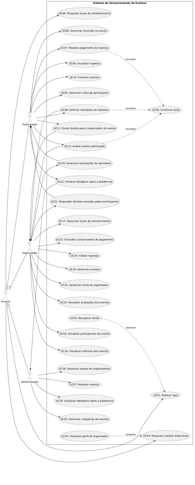
</div>

---

### Diagrama de Arquitetura

Apresenta a visão macro da arquitetura do sistema, baseada em microsserviços, com os principais serviços, responsabilidades e interações entre eles.

<div align="center">
  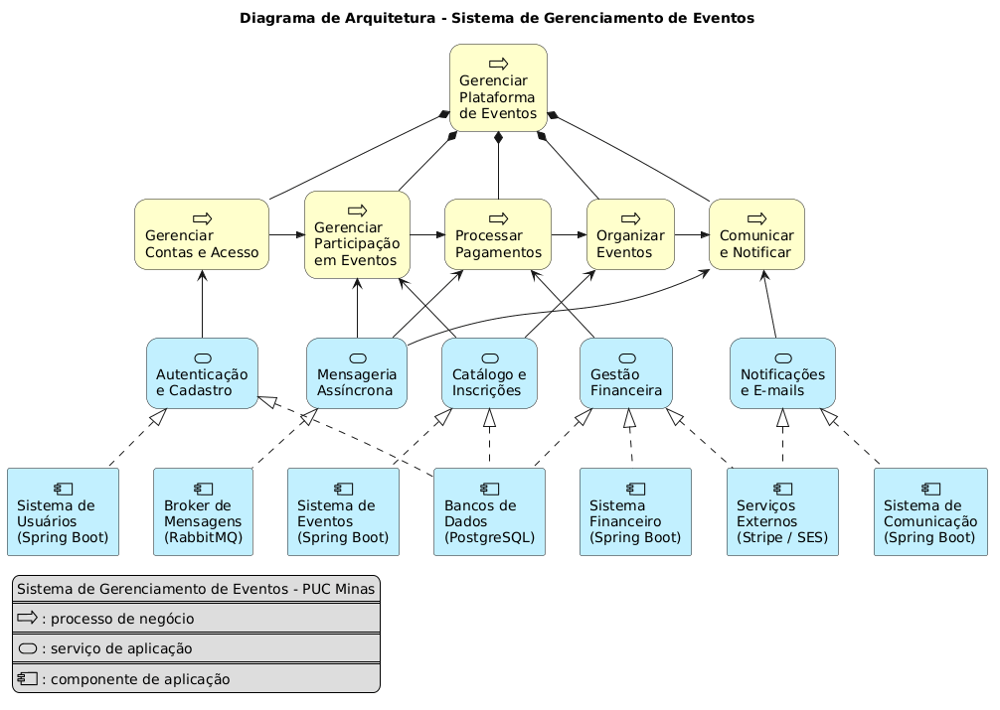
</div>

---

### Diagrama de Classes

Define a estrutura estática do sistema, com as entidades principais, seus atributos, métodos e os relacionamentos entre as classes.

<div align="center">
  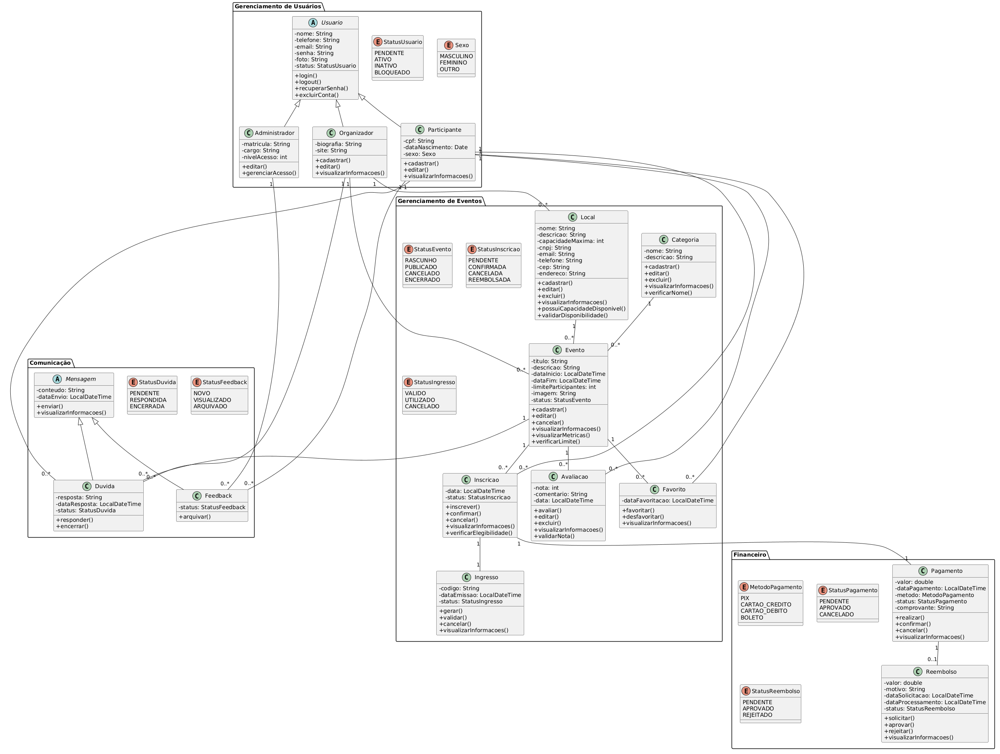
</div>

---

### Diagrama de Componentes

Descreve a organização dos componentes de software do sistema e as interfaces que os conectam.

<div align="center">
  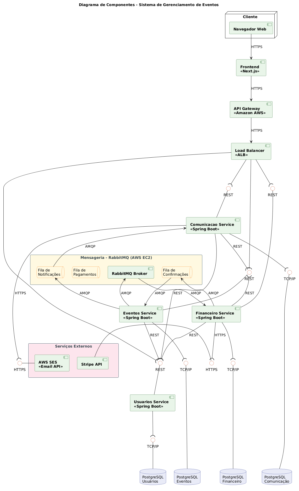
</div>

---

### Diagrama de Implantação

Ilustra a infraestrutura física e lógica de implantação do sistema, incluindo servidores, contêineres e a distribuição dos serviços.

<div align="center">
  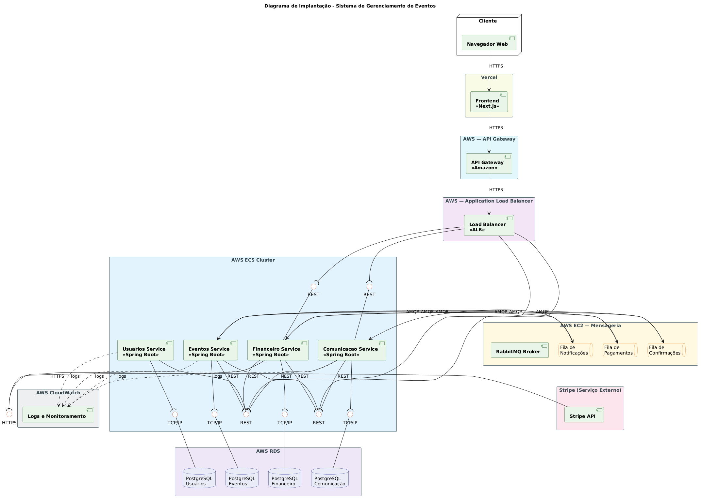
</div>

---

### Modelo Lógico

Representa o modelo lógico de dados do sistema, com as entidades, atributos e relacionamentos do banco de dados.

<div align="center">
  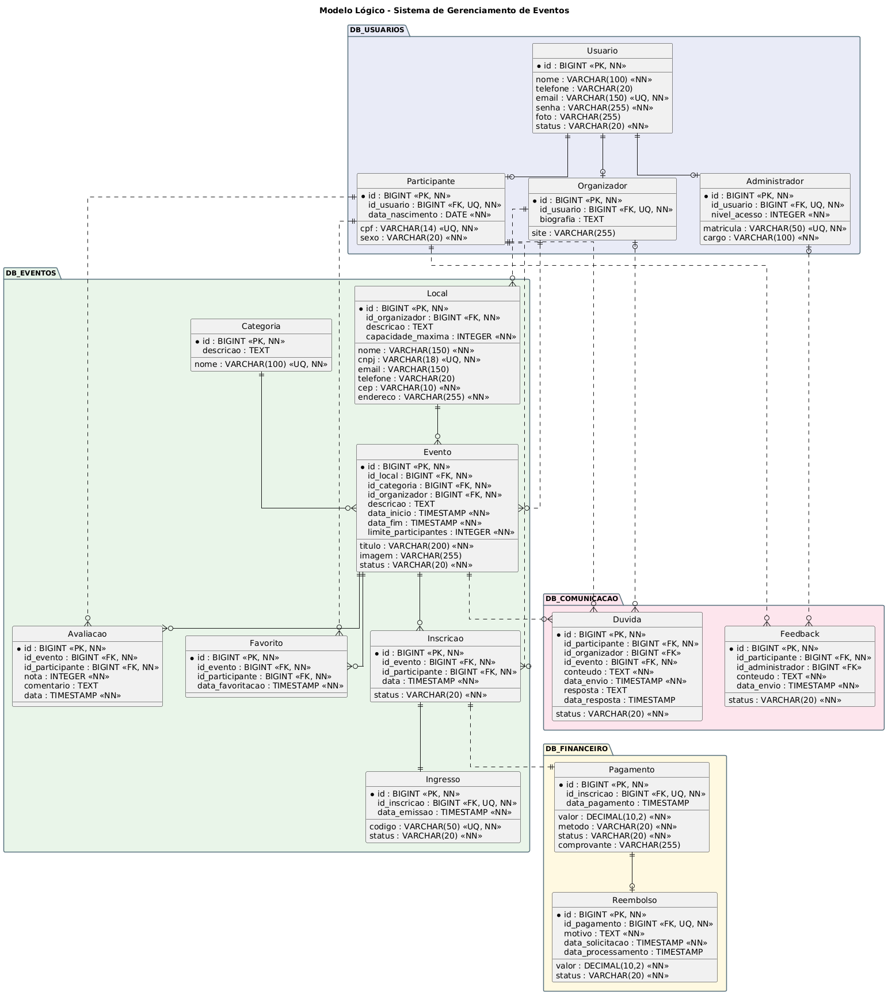
</div>

---

### Diagrama de Estados

Modela o ciclo de vida dos principais objetos do sistema, especificando os estados possíveis e as transições entre eles.

<div align="center">
  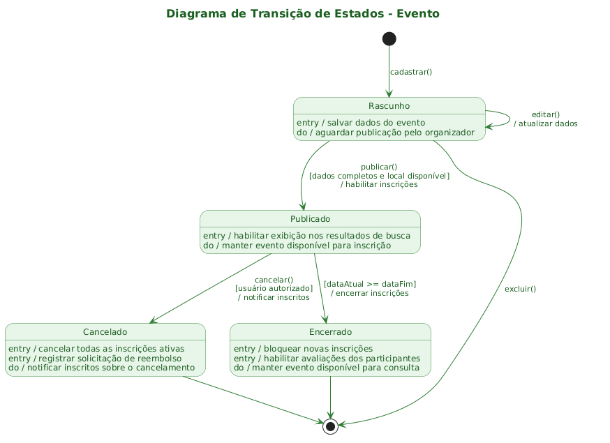
</div>

---

### Diagramas de Sequência

Detalham a ordem das interações entre os objetos do sistema para os fluxos mais relevantes.

#### Sequência Geral

<div align="center">
  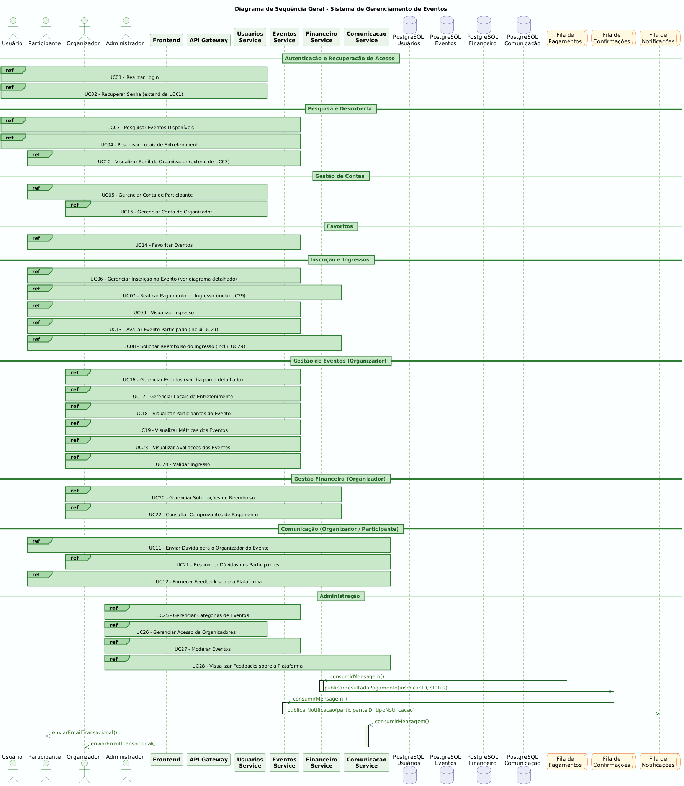
</div>

#### UC06 - Gerenciar Inscrição no Evento

| Diagrama de Sequência | Diagrama de Comunicação |
| :-------------------: | :---------------------: |
| 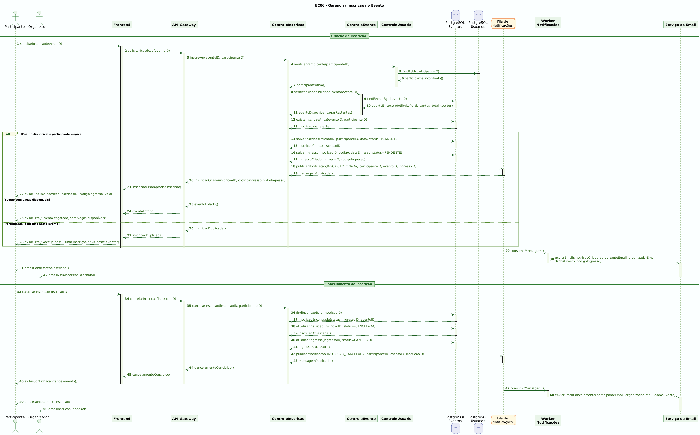 | 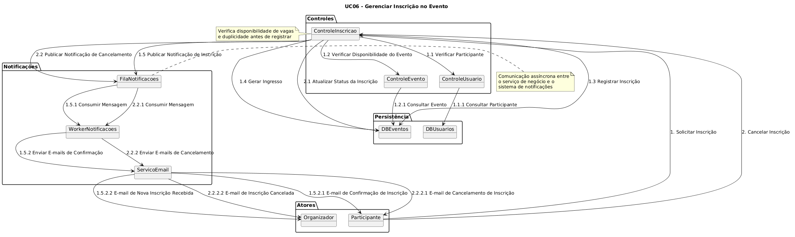 |

#### UC07 - Realizar Pagamento do Ingresso

| Diagrama de Sequência | Diagrama de Comunicação |
| :-------------------: | :---------------------: |
| 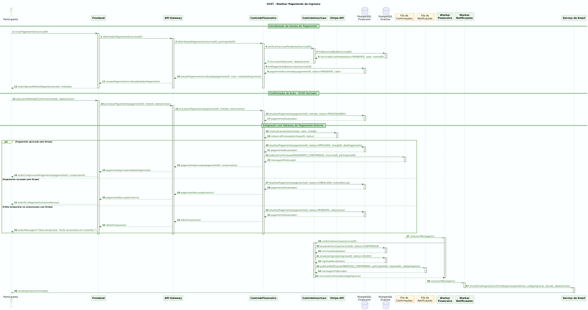 | 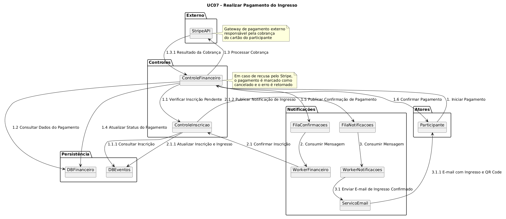 |

#### UC16 - Gerenciar Eventos

| Diagrama de Sequência | Diagrama de Comunicação |
| :-------------------: | :---------------------: |
| 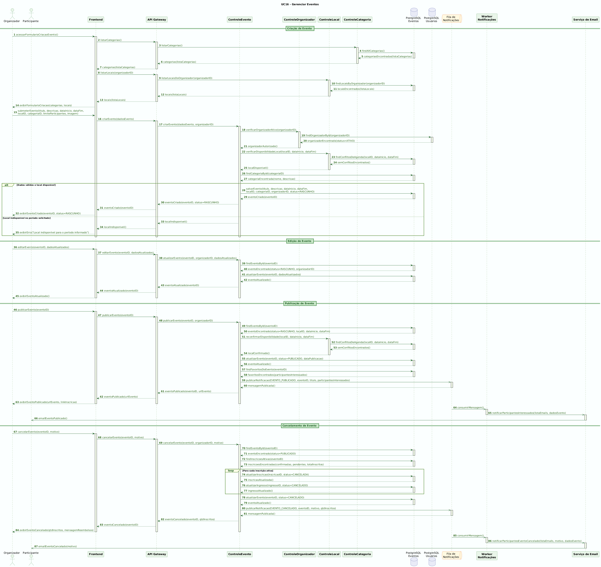 | 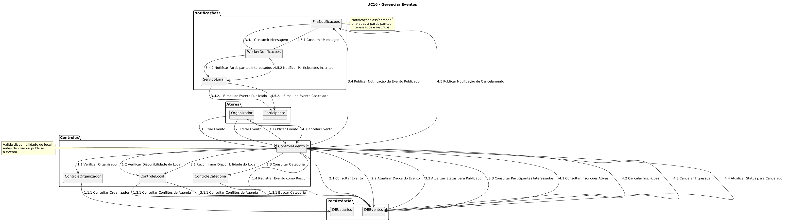 |

---

### Diagramas de Comunicação

Os diagramas de comunicação dos casos de uso UC06, UC07 e UC16 estão agrupados junto aos respectivos diagramas de sequência na [seção anterior](#diagramas-de-sequência).

---

## 📂 Estrutura de Pastas

```
.
├── README.md                                      # 📘 Documentação principal do projeto
├── LICENSE.md                                     # ⚖️ Licença MIT do projeto
│
├── codes/                                         # 📁 Código-fonte dos diagramas PlantUML
│   ├── architecture-diagram/
│   │   └── architecture-diagram.puml              # 🏗️ Diagrama de Arquitetura
│   ├── class-diagram/
│   │   └── class-diagram.puml                     # 🧬 Diagrama de Classes
│   ├── communication-diagram/
│   │   ├── uc06-communication-diagram.puml        # 💬 Diagrama de Comunicação - UC06
│   │   ├── uc07-communication-diagram.puml        # 💬 Diagrama de Comunicação - UC07
│   │   └── uc16-communication-diagram.puml        # 💬 Diagrama de Comunicação - UC16
│   ├── component-diagram/
│   │   └── component-diagram.puml                 # 🧩 Diagrama de Componentes
│   ├── deployment-diagram/
│   │   └── deployment-diagram.puml                # 🌐 Diagrama de Implantação
│   ├── logical-model/
│   │   └── logical-model.puml                     # 🗄️ Modelo Lógico de Dados
│   ├── sequence-diagram/
│   │   ├── general-sequence-diagram.puml          # 🔁 Diagrama de Sequência Geral
│   │   ├── uc06-sequence-diagram.puml             # 🔁 Diagrama de Sequência - UC06
│   │   ├── uc07-sequence-diagram.puml             # 🔁 Diagrama de Sequência - UC07
│   │   └── uc16-sequence-diagram.puml             # 🔁 Diagrama de Sequência - UC16
│   ├── state-diagram/
│   │   └── state-diagram.puml                     # 🔄 Diagrama de Estados
│   └── use-case-diagram/
│       └── use-case-diagram.puml                  # 🎯 Diagrama de Casos de Uso
│
├── docs/
│   └── project-documentation.pdf                 # 📄 Documentação completa do projeto (TCC)
│
└── images/                                        # 📁 Imagens exportadas dos diagramas
    ├── architecture-diagram/
    │   └── architecture-diagram.png
    ├── class-diagram/
    │   └── class-diagram.png
    ├── communication-diagram/
    │   ├── uc06-communication-diagram.png
    │   ├── uc07-communication-diagram.png
    │   └── uc16-communication-diagram.png
    ├── component-diagram/
    │   └── component-diagram.png
    ├── deployment-diagram/
    │   └── deployment-diagram.png
    ├── logical-model/
    │   └── logical-model.png
    ├── sequence-diagram/
    │   ├── general-sequence-diagram.png
    │   ├── uc06-sequence-diagram.png
    │   ├── uc07-sequence-diagram.png
    │   └── uc16-sequence-diagram.png
    ├── state-diagram/
    │   └── state-diagram.png
    └── use-case-diagram/
        └── use-case-diagram.png
```

---

## 🔗 Documentações Utilizadas

- 📖 **Linguagem de Modelagem:** [Documentação Oficial do **PlantUML**](https://plantuml.com/guide)
- 📖 **Padrão UML:** [Especificação UML 2.5 - Object Management Group (OMG)](https://www.omg.org/spec/UML/2.5.1/)
- 📖 **Guia de Estilo:** [**Conventional Commits** (Padrão de Mensagens)](https://www.conventionalcommits.org/en/v1.0.0/)
- 📖 **Referência Acadêmica:** [Normas de TCC - PUC Minas](https://www.pucminas.br/)

---

## 👨🏻‍💻 Autor

---

| [<br><sub>Artur Bomtempo</sub>](https://arturbomtempo.dev/) |
| :--------------------------------------------------------------------------------------------------------------------------------------------------: |

Desenvolvido por Artur Bomtempo 👋🏻. Entre em contato:

[](mailto:arturbcolen@gmail.com)
[](https://www.linkedin.com/in/artur-bomtempo/)
[](https://www.instagram.com/arturbomtempo.dev/)

---

## 🙏 Agradecimentos

- [**Engenharia de Software PUC Minas**](https://www.instagram.com/engsoftwarepucminas/) - Pelo apoio institucional, estrutura acadêmica e fomento às boas práticas de Engenharia de Software.
- [**Prof. Dr. João Paulo Aramuni**](https://github.com/joaopauloaramuni) - Pelos ensinamentos sobre **Projeto de Software**, **Arquitetura de Software** e **Padrões de Projeto**, e pelo template base deste README.
- [**PlantUML**](https://plantuml.com/) - Pela ferramenta open-source que tornou possível a criação de todos os diagramas deste projeto de forma simples e eficiente.

---

## 📄 Licença

Este projeto é distribuído sob a **[Licença MIT](./LICENSE.md)**.
